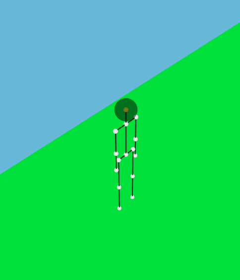
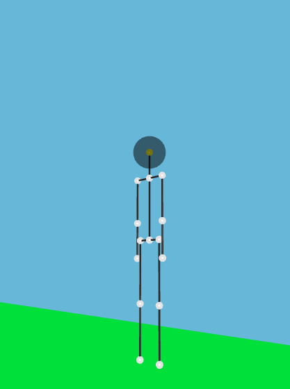

# Constructor de homactogramas 3D de Castelog

Homactógrafo 3D de Castelog. Un homactógrafo es una herramienta para representar al humano en acción.

## Versión online

Puedes ir directamente a la versión online a:

 - [https://allnulled.github.io/constructor-de-homactogramas-3d-de-castelog](https://allnulled.github.io/constructor-de-homactogramas-3d-de-castelog).

## Introducción

Pues él es PaloMan.

Ves. Aquí desde otro punto de vista. Hay que mejorarlo.

### ¿De que se trata?

La idea es hacer scripts con Castelog para representar escenas de cine. Más adelante, poder crear novelas gráficas (novelas interactivas). Y potencialmente, programar videojuegos en 3D. Principalmente, es una herramienta de expresión para representar realidades.

Pero ¿realmente? Es una interfaz para interactuar con [Babylon.js](#) y el [HTML5 Canvas API](#) pero mediante Castelog, lo cual naturaliza esta expresividad bastante, sin perder la potencia de la programación con JavaScript. Es muy guay, es demasiado guay para que no tenga porros, yo no soy comercial, yo no soy empresario, yo solo programo, y solo pido porros, dejémoslo, eres el Diablo, y me quieres hacer sufrir. No puedo continuar desarrollando. Y no quiero volver a sentir que me lo das y me lo quitas. Si sois extraterrestres, sois odiosos. Y si eres el Diablo, eres odioso. Y si sois los humanos, sois odiosos. No sé quién ni qué, pero eres odioso.

No puedo seguir desarrollando. Otra vez síndrome de abstinencia por pobre. No lo voy a soportar, puta raza política, encubridora de mafiosos asquerosos metafísicos enfermos mentales odiosos.

## Referencia oficial de la API del Homactógrafo 3D de Castelog

### Funciones de la API del Homactógrafo 3D de Castelog

Esta tabla muestra todas las funciones de la API. Las encontrarás en el fichero `src/www/*/homactografo.js`.  

| Método | Parámetros | Descripción |
| ---------------------------------- | --------------- | ---------------- |
| Utilidades.extraer_de_parametros | Sin parámetros. | Sin descripción. |
| Utilidades.extraer_como_vector | Sin parámetros. | Sin descripción. |
| Escena_estandar.constructor | Sin parámetros. | Sin descripción. |
| Escena_estandar.prepararse | Sin parámetros. | Sin descripción. |
| Escena_estandar.activarse | Sin parámetros. | Sin descripción. |
| Escena_estandar.desactivarse | Sin parámetros. | Sin descripción. |
| Escena_estandar.establecer_color | Sin parámetros. | Sin descripción. |
| Escena_estandar.establecer_fondo_fijo | Sin parámetros. | Sin descripción. |
| Escena_estandar.establecer_fondo_panoramico | Sin parámetros. | Sin descripción. |
| Video_de_youtube_estandar.constructor | Sin parámetros. | Sin descripción. |
| Video_de_youtube_estandar.prepararse | Sin parámetros. | Sin descripción. |
| Video_de_youtube_estandar.reproducirse | Sin parámetros. | Sin descripción. |
| Video_de_youtube_estandar.pararse | Sin parámetros. | Sin descripción. |
| Video_de_youtube_estandar.reiniciarse | Sin parámetros. | Sin descripción. |
| Sonido_estandar.constructor | Sin parámetros. | Sin descripción. |
| Sonido_estandar.prepararse | Sin parámetros. | Sin descripción. |
| Sonido_estandar.reproducirse | Sin parámetros. | Sin descripción. |
| Sonido_estandar.pararse | Sin parámetros. | Sin descripción. |
| Sonido_estandar.reiniciarse | Sin parámetros. | Sin descripción. |
| Objeto_estandar.constructor | Sin parámetros. | Sin descripción. |
| Objeto_estandar.moverse | Sin parámetros. | Sin descripción. |
| Objeto_estandar.posicionarse | Sin parámetros. | Sin descripción. |
| Objeto_estandar.establecer_color | Sin parámetros. | Sin descripción. |
| Objeto_estandar.establecer_color | Sin parámetros. | Sin descripción. |
| Objeto_estandar.establecer_textura_de_video | Sin parámetros. | Sin descripción. |
| Objeto_plano_estandar.constructor | Sin parámetros. | Sin descripción. |
| Objeto_plano_estandar.prepararse | Sin parámetros. | Sin descripción. |
| Objeto_cubo_estandar.constructor | Sin parámetros. | Sin descripción. |
| Objeto_cubo_estandar.prepararse | Sin parámetros. | Sin descripción. |
| Objeto_cilindro_estandar.constructor | Sin parámetros. | Sin descripción. |
| Objeto_cilindro_estandar.prepararse | Sin parámetros. | Sin descripción. |
| Objeto_esfera_estandar.constructor | Sin parámetros. | Sin descripción. |
| Objeto_esfera_estandar.prepararse | Sin parámetros. | Sin descripción. |
| Objeto_donut_estandar.constructor | Sin parámetros. | Sin descripción. |
| Objeto_donut_estandar.prepararse | Sin parámetros. | Sin descripción. |
| Objeto_suelo_estandar.constructor | Sin parámetros. | Sin descripción. |
| Objeto_suelo_estandar.prepararse | Sin parámetros. | Sin descripción. |
| Camara_estandar.constructor | Sin parámetros. | Sin descripción. |
| Camara_estandar.prepararse | Sin parámetros. | Sin descripción. |
| Camara_estandar.enfocarse_a | Sin parámetros. | Sin descripción. |
| Camara_estandar.activarse | Sin parámetros. | Sin descripción. |
| Luz_estandar.constructor | Sin parámetros. | Sin descripción. |
| Luz_estandar.prepararse | Sin parámetros. | Sin descripción. |
| Luz_estandar.enfocarse_a | Sin parámetros. | Sin descripción. |
| Persona.constructor.utilidad_de_aplicar_rotacion | Sin parámetros. | Sin descripción. |
| Persona.constructor.utilidad_de_aplicar_posicionamiento | Sin parámetros. | Sin descripción. |
| Persona.constructor.Extender_con_api_de_movimientos_de_bajo_nivel_de_paloman | Sin parámetros. | Sin descripción. |
| Persona.constructor | Sin parámetros. | Sin descripción. |
| Persona.prepararse | Sin parámetros. | Sin descripción. |
| Persona.constructor.configuraciones_por_defecto | Sin parámetros. | Sin descripción. |
| Persona.constructor.locales_por_defecto | Sin parámetros. | Sin descripción. |
| Persona.constructor.utilidades_por_defecto | Sin parámetros. | Sin descripción. |
| Persona.componerse | Sin parámetros. | Sin descripción. |
| Persona_estandar.constructor | Sin parámetros. | Sin descripción. |
| Persona_estandar.prepararse_para_persona_estandar | Sin parámetros. | Sin descripción. |
| Persona_estandar.moverse | Sin parámetros. | Sin descripción. |
| Persona_estandar.posicionarse | Sin parámetros. | Sin descripción. |
| Homactografo.constructor.registrar_tipo_en_homactografo | Sin parámetros. | Sin descripción. |
| Homactografo.constructor.crear_instancia_en_homactografo | Sin parámetros. | Sin descripción. |
| Homactografo.constructor.eliminar_instancia_en_homactografo | Sin parámetros. | Sin descripción. |
| Homactografo.constructor.seleccionar_muchos_en_homactografo | Sin parámetros. | Sin descripción. |
| Homactografo.constructor.seleccionar_uno_en_homactografo | Sin parámetros. | Sin descripción. |
| Homactografo.ejecutar_inyecciones_en_bucle_de_escena | Sin parámetros. | Sin descripción. |
| Homactografo.constructor | Sin parámetros. | Sin descripción. |
| Homactografo.prepararse | Sin parámetros. | Sin descripción. |
| Homactografo.cargar_eventos_del_dom | Sin parámetros. | Sin descripción. |
| Homactografo.cargar_tipos | Sin parámetros. | Sin descripción. |
| Homactografo.cargar_instancias | Sin parámetros. | Sin descripción. |
| Homactografo.cargar_inyector_en_bucle_de_escena | Sin parámetros. | Sin descripción. |
| Homactografo.clases | Sin parámetros. | Sin descripción. |
| Homactografo.instancias | Sin parámetros. | Sin descripción. |
| Homactografo.registrar_tipo_de_escena | Sin parámetros. | Sin descripción. |
| Homactografo.registrar_tipo_de_camara | Sin parámetros. | Sin descripción. |
| Homactografo.registrar_tipo_de_luz | Sin parámetros. | Sin descripción. |
| Homactografo.registrar_tipo_de_persona | Sin parámetros. | Sin descripción. |
| Homactografo.registrar_tipo_de_objeto | Sin parámetros. | Sin descripción. |
| Homactografo.crear_escena | Sin parámetros. | Sin descripción. |
| Homactografo.crear_camara | Sin parámetros. | Sin descripción. |
| Homactografo.crear_luz | Sin parámetros. | Sin descripción. |
| Homactografo.crear_persona | Sin parámetros. | Sin descripción. |
| Homactografo.crear_sonido | Sin parámetros. | Sin descripción. |
| Homactografo.crear_objeto | Sin parámetros. | Sin descripción. |
| Homactografo.crear_objeto_esfera | Sin parámetros. | Sin descripción. |
| Homactografo.crear_objeto_suelo | Sin parámetros. | Sin descripción. |
| Homactografo.seleccionar_por_filtro | Sin parámetros. | Sin descripción. |
| Homactografo.seleccionar_escenas | Sin parámetros. | Sin descripción. |
| Homactografo.seleccionar_camaras | Sin parámetros. | Sin descripción. |
| Homactografo.seleccionar_luces | Sin parámetros. | Sin descripción. |
| Homactografo.seleccionar_personas | Sin parámetros. | Sin descripción. |
| Homactografo.seleccionar_sonidos | Sin parámetros. | Sin descripción. |
| Homactografo.seleccionar_objetos | Sin parámetros. | Sin descripción. |
| Homactografo.seleccionar_por_id | Sin parámetros. | Sin descripción. |
| Homactografo.seleccionar_escena | Sin parámetros. | Sin descripción. |
| Homactografo.seleccionar_camara | Sin parámetros. | Sin descripción. |
| Homactografo.seleccionar_luz | Sin parámetros. | Sin descripción. |
| Homactografo.seleccionar_persona | Sin parámetros. | Sin descripción. |
| Homactografo.seleccionar_sonido | Sin parámetros. | Sin descripción. |
| Homactografo.seleccionar_objeto | Sin parámetros. | Sin descripción. |
| Homactografo.eliminar_escena | Sin parámetros. | Sin descripción. |
| Homactografo.eliminar_camara | Sin parámetros. | Sin descripción. |
| Homactografo.eliminar_luz | Sin parámetros. | Sin descripción. |
| Homactografo.eliminar_persona | Sin parámetros. | Sin descripción. |
| Homactografo.eliminar_sonido | Sin parámetros. | Sin descripción. |
| Homactografo.eliminar_objeto | Sin parámetros. | Sin descripción. |

## Ayuda adicional

Estas cheat sheets (en progreso) son de soporte para el desarrollo de gráficos 3D:

 - De **[Babylon.js JS API](#)** en [BABYLONJS.md](./BABYLONJS.md)
 - De **[Blender GUI](#)** en [BLENDER.md](./BLENDER.md)
 - De **[Blender 3.5.1 Python API](#)** en [BLENDER.PY.md](./BLENDER.PY.md)
